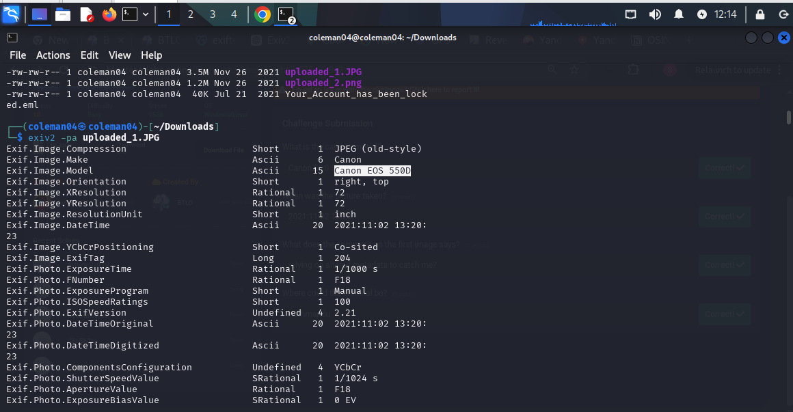
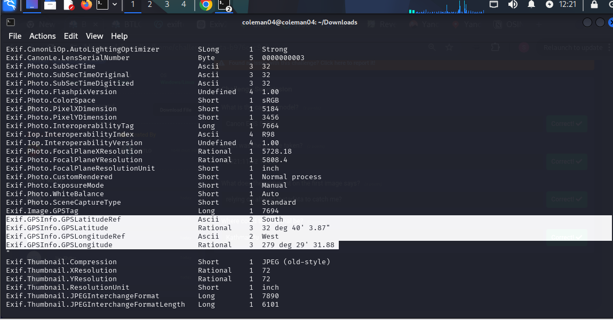

# Image Metadata Extraction & Analysis (ExifTool)

## Project Summary
- **Project Type:** OSINT / Digital Forensics
- **Detection Method:** Metadata extraction via ExifTool/exiv2
- **Tools Used:** exiv2, Kali Linux
- **Status:** Completed

## Executive Summary
This project demonstrates how embedded metadata (EXIF data) in image files can expose sensitive information such as device details, timestamps, and GPS coordinates. Using exiv2 on Kali Linux, a sample image was analyzed to extract and interpret this hidden data.

## Objective
- Understand what metadata is embedded in typical image files
- Practice extracting metadata using exiv2 from the command line
- Interpret the extracted data (device model, timestamp, GPS coordinates)
- Demonstrate the OSINT/privacy risk of unedited image sharing

## Investigation Methodology

### 1. Metadata Extraction
Ran the following command to pull metadata from the image:

```
exiv2 -pa uploaded_1.JPG
```

This returned camera make/model, exposure settings, and timestamp fields.



**Key fields found:**
- Camera Make: Canon
- Camera Model: Canon EOS 550D
- Date/Time Original: 2021:11:02 13:20:23
- Exposure Time: 1/1000s
- F-Number: F18

### 2. GPS/Location Analysis
- Extracted GPS Latitude and Longitude fields from the metadata
- Cross-referenced coordinates to confirm location exposure risk



## Indicators / Extracted Data

| Field              | Value                  | Notes                        |
|--------------------|------------------------|-------------------------------|
| Camera Make/Model  | Canon EOS 550D         | Identifies device used        |
| Date/Time Original | 2021:11:02 13:20:23    | Confirms when photo was taken |
| GPS Coordinates    | [ 32°40'3.87" S, 279°29'31.88" W] | Location exposure          |

## Mitigation / Takeaway
- Recommend stripping EXIF metadata before publicly sharing images (`exiv2 -d a image.jpg`)
- Demonstrates why OSINT investigators check metadata as a first step, and why individuals should sanitize images before posting online

## References
- exiv2 documentation: https://exiv2.org/
